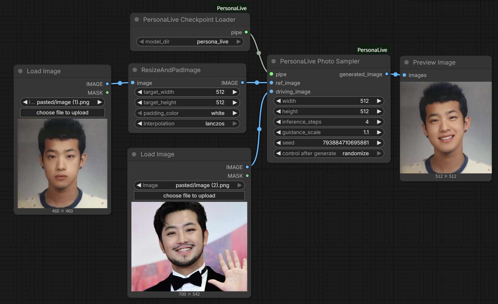

# ComfyUI-PersonaLive



This is a ComfyUI custom node implementation of **PersonaLive: Expressive Portrait Image Animation for Live Streaming**.

> [!NOTE]
> Currently, this implementation only supports **Image Input** (driving the portrait with a single reference image). Video driving support is planned for future updates.

**Original Repository**: [GVCLab/PersonaLive](https://github.com/GVCLab/PersonaLive)  
**Paper**: [ArXiv 2512.11253](https://arxiv.org/abs/2512.11253)

We deeply appreciate the authors **Zhiyuan Li, Chi-Man Pun, Chen Fang, Jue Wang,** and **Xiaodong Cun** for their amazing work and for sharing their code.

---

## 🛠 Installation

1.  **Clone this repository** into your `ComfyUI/custom_nodes/` directory:
    ```bash
    cd ComfyUI/custom_nodes/
    git clone https://github.com/YOUR_USERNAME/ComfyUI-PersonaLive.git
    cd ComfyUI-PersonaLive
    pip install -r requirements.txt
    ```

2.  **Model Setup**:
    Create a folder named `persona_live` inside your `ComfyUI/models/` directory.
    
    Structure:
    ```
    ComfyUI/models/
    └── persona_live/
        ├── sd-image-variations-diffusers/  <-- Base Model
        ├── sd-vae-ft-mse/                  <-- VAE
        └── personalive/                    <-- PersonaLive Weights (.pth files)
    ```

    - **Download Base Models**:
        - [sd-image-variations-diffusers](https://huggingface.co/lambdalabs/sd-image-variations-diffusers)
        - [sd-vae-ft-mse](https://huggingface.co/stabilityai/sd-vae-ft-mse)
    - **Download PersonaLive Weights**:
        - Get them from the [Hugging Face repo](https://huggingface.co/huaichang/PersonaLive) or other links provided in the original `README`.
        - Place the `.pth` files (`denoising_unet.pth`, `motion_encoder.pth`, etc.) inside the `models/persona_live/personalive/` folder.

## 🚀 Usage

1.  **PersonaLiveCheckpointLoader**: Select the `model_dir` (e.g., `persona_live`) that contains all your models.
2.  **PersonaLivePhotoSampler**:
    - Connect the pipeline from the loader.
    - Connect `ref_image` (source portrait) and `driving_image` (pose reference).
    - Set `width` and `height` (default 512). The node automatically resizes inputs to this resolution for processing and then restores the original resolution for the output.

### Usage Tips
- **Input Images**: It is highly recommended to use **square images (1:1 aspect ratio)** for both `ref_image` and `driving_image` to ensure the best face alignment and generation quality.
- **Inference Steps**: The model is optimized for **4 steps**. If you increase this value, ensure it is a **multiple of 4** (e.g., 8, 12, 16) to prevent errors.

## 🧪 Example Workflow

An example workflow is provided in the `example` folder. You can drag and drop the `.json` file from there into ComfyUI to get started quickly.

## 📝 To-Do
- [ ] Support Video Input (Driving Video)

## ❤️ Acknowledgements

This project is simply a ComfyUI wrapper. All credit for the underlying technology and model architecture goes to the original authors of PersonaLive and the projects they built upon (Moore-AnimateAnyone, X-NeMo, StreamDiffusion, RAIN, LivePortrait).
